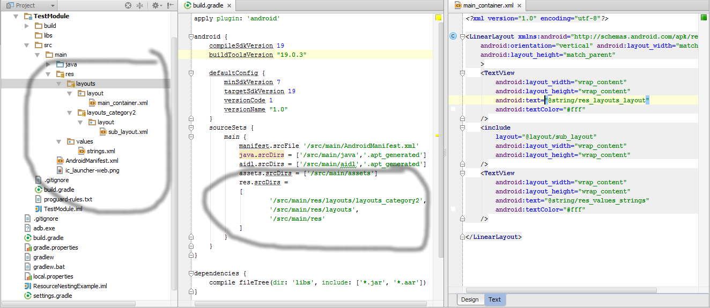

ResourceNestingExample
======================

This is a demo app for android that shows how to create nested resource directories using the gradle build system.





The trick to nesting resource folders is to use gradle's ability to merge multiple resource folders, and set the res folder as well as the nested subfolders in the sourceSets block.

The quirk is that you can't declare a container resource folder before you declare that folder's child resource folders.

Below is the sourceSets block from the build.gradle file. Notice that the subfolders are declared first.
```
sourceSets {
    main {
        manifest.srcFile '/src/main/AndroidManifest.xml'
        java.srcDirs = ['/src/main/java','.apt_generated']
        aidl.srcDirs = ['/src/main/aidl','.apt_generated']
        assets.srcDirs = ['/src/main/assets']
        res.srcDirs =
        [
                '/src/main/res/layouts/layouts_category2',
                '/src/main/res/layouts',
                '/src/main/res'
        ]
    }
}
```
